# kids Store
Kids-Store is a fictitious full function B2C e-commerce kids’ department, powered by Django. This is a final project for the Full-Stack Software Development Course at Code Institute.

#### To see the Live Link: [click here](https://ecommerce-2024-b3dc24d9bd28.herokuapp.com/)

## Table of Content:
* [Introduction](#introduction)
* [UI/UX](#ui/ux)
  * [User Demographic](#user-demographic)
  * [User Stories](#user-stories)
  * [Wireframes](#Wireframes)
  * [Flowchart](#Flowchart)
* [Technologies Used](#technologies-used)  
* [Features](#features) 
  * [Existing Features](#existing-features)
  * [Future Features](#future-features)
* [Marketing Strategy](#marketing-strategy)  
* [Testing](#testing)
* [Deployment](#deployment-heroku)
* [How to Fork this Repository](#how-to-fork-this-repository)
* [How to clone this Repository](#how-to-clone-this-repository)
* [Technologies Used](#Technologies-used)
* [Credits](#credits)
* [Acknowledgments](#acknowledgments)
---
Back to [Top](#kids-store)

## **Introduction**
Our Departemt Store focuses on Kids clothing specializing in Seasonal and Occational dressing. Our designers collections specially for Birthday for all gender are the one which makes Our Departemet Store Standout form Our Competiters.
We also supply for our Cutomers Limited Editions according to their test for their little Engels at any time of the year. 
## **UI/UX**
  ### **User Demographic**
  This Site Targets Users Who are:

  * Looking a unique designer Clothing For Their <b>Little</b> ones.
  * Looking for quality fabrick with affordable price
  * Looking for multi alternatives with diverse size and color
  * Looking for seasonal clothing before hand 

  ### **User Stories**

  * As a Site User I can access the available offer so that I can easily use the opportunity on selected products

* As a Site User I can view a list of products categories so that I can easily select for my purchase

* As a Site User I can select a particular product so that easily have a detailed description available size with picture and add to cart option

* As a Site User I can have an option to purchase without an account so that I can quickly pick what I want

* As a Site User I can register to the website so that I can have a personalized profile and easily interact for the purchasing process

* As a Site User I can have my account so that I can easily login/logout

* As a Site User I can have a personal user profile so that I can easily access my order story, order conformation and payment information

* As a Site User I can have an easy password recovery option so that I can easily recover my password if I forgot it

* As a Site User I can have an easy searching option so that I can easily search a specific item from the list

* As a Site User I can sort multiple categories of products with description so that I can easily compare the quality and price

* As a Site User I can select my choice so that I can easily pick the right size, color and quality of my product

* As a Site User I can have a place to collect my choices so that I can easily pick what I really want to purchase

* As a Site User I can easily fill my payment information so that I can easily check out and settle the payment 

* As a Site User I can view an order conformation after checkout so that I cans easily verify everything went well

* As a Site User I can receive an email conformation after checkout so that I can easily keep the conformation of what I have purchased for my records

* As a site User I can have the option to keep my wishes so that I can easily select 

* As a Site Admin I can view my store so that I can easily inspect the overall situation of my site

* As a Site Admin I can add a product so that I can easily add new items to my store so that I can stay competitive

* As a Site Admin I can edit the product so that I can easily update the product with price and quality

* As a Site Admin I can delete a product so that I can easily remove products that are not for sale

### **Wireframes**

  Wireframe are used to give a visual feedback after taking the general structure of the site and they also help as a reminder for the basic components of the site

  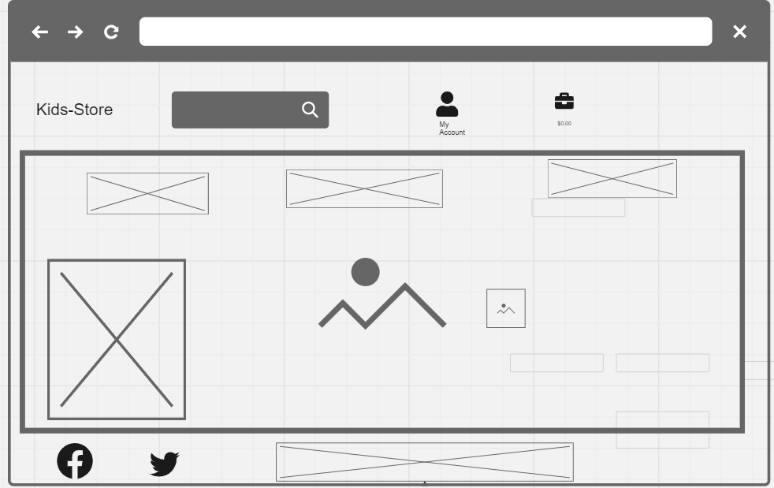
  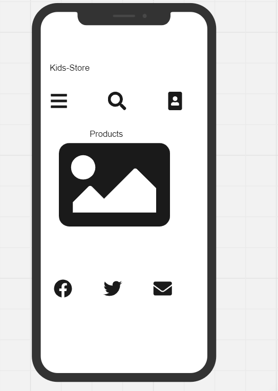

### **Flowchart**
This flowchart was created to determine the flow of the website. It shows which pages are available to the user. It takes into account if the user is logged in to the website or not.

Back to [Top](#table-of-content)

## **Technologies Used**
* *Django* - The Django framework was used to develop this application.
* *Django AllAuth* - Used to create account, login and logout users of the site.
* *Python* - This application was developed using Python.
* *ElephantSQL* - was used to host the external database.
* *HTML* - was used to develop the templates in this project.
* *CSS* - was used to style the page by customizing it.
* *Lucid chart* - Used to create the flowchart.
* *Bootstrap* - was used for the fast development of the layout and styling
* *Gitpod* - IDE used for the development of the  application.
* *jQuery* - jQuery was used to develop the date and time pickers.
* *GitHub* - The code for this application is stored on GitHub.
* *Git* - Used for version control.
* *Heroku* - Used for development.
* *JavaScript* -

Back to [Top](#table-of-content)

## **Features**
### **Existing Features**

### Home Page

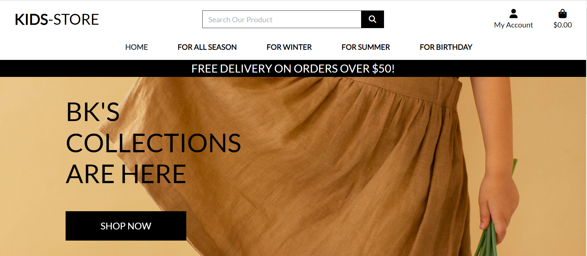

* A home page also displaying a quick link to the shopping area of the site.
* A home page with a search options, Account registration and login, shopping bag and clicable dropdown nav link displaying different features of the products

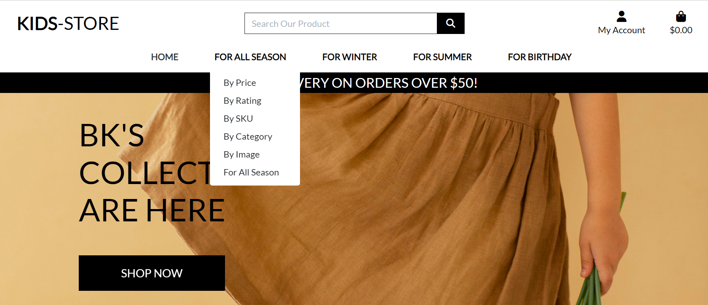

* A home page renders well for all screen size media.

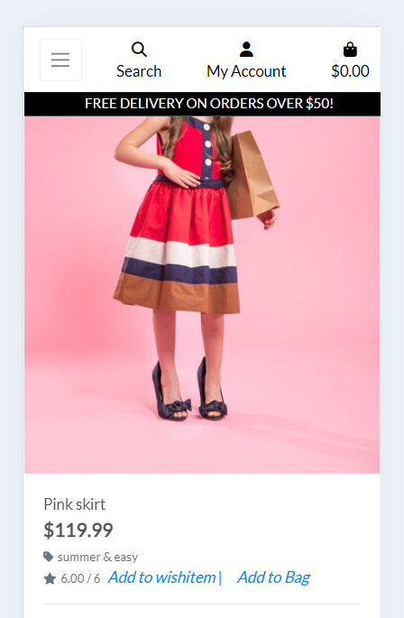

### Search Bar

* Search button: This will help our Customers esily search for the particular product

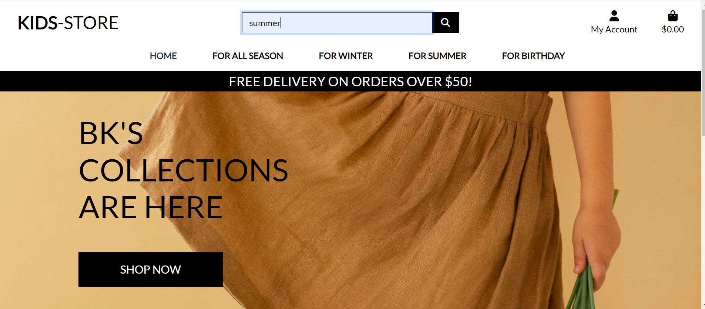

### My Account

* My Account: This Section will give the Customer to Register and for the registerd customer can login using this. The Site Admin can also Login Using his/her credentials

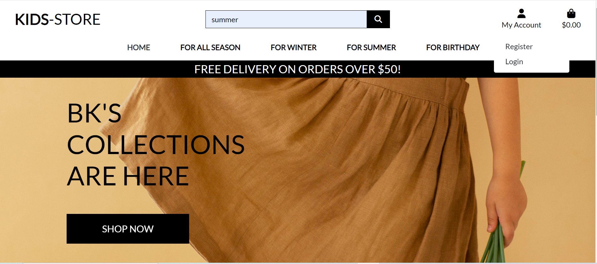

* Account Registation Form: This form will display the detaild input with a requird fild. When it is filled with the correct information a conformation email will be sent to the customer and onece confirmed a successful registration success message will display.

#### Sign-Up

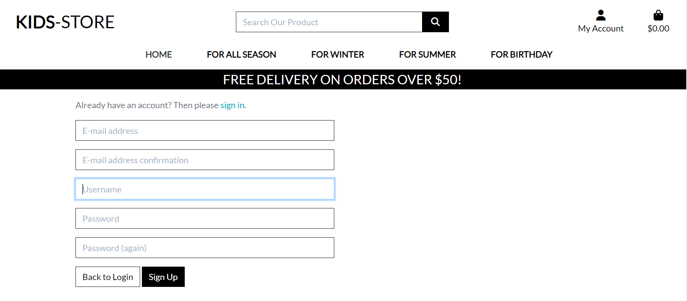

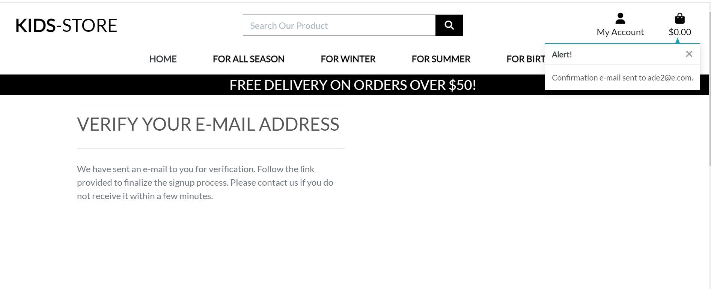

#### Sign-In

* Sign In: Once the customers successfully registed they can use their credentials to sign in and access their profile.They also get the success message using either their User name or email. If the customer forgets the password it can be easily reconfigured using the forgot password link

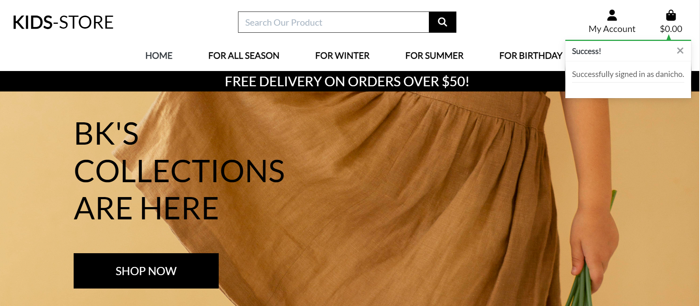

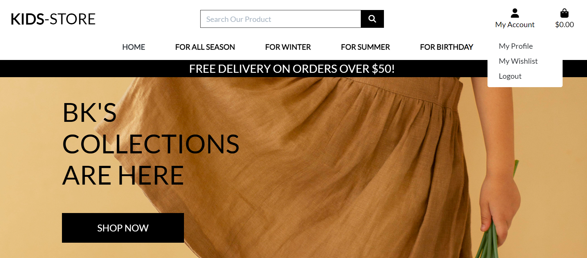

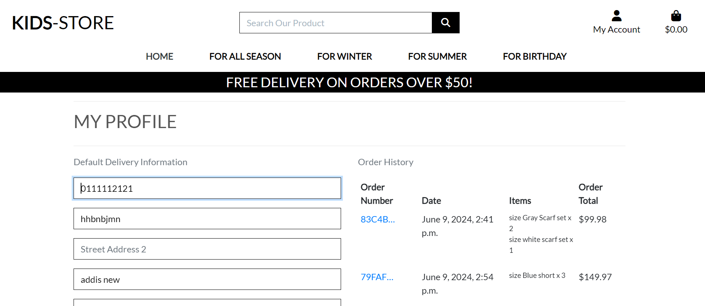

##### Admin/Super user 

* The Admin can access teh Administrative page from both Home page and /admin.When Accessd from the Home page

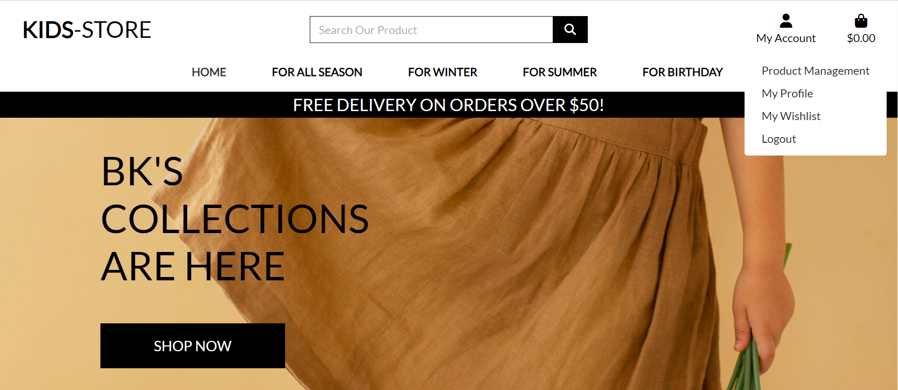

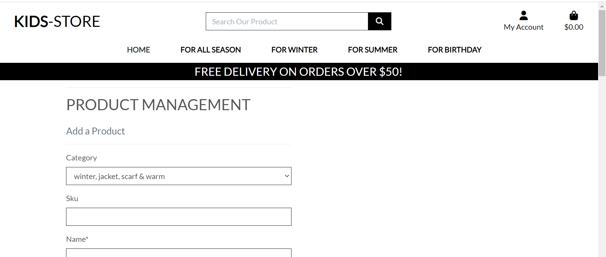

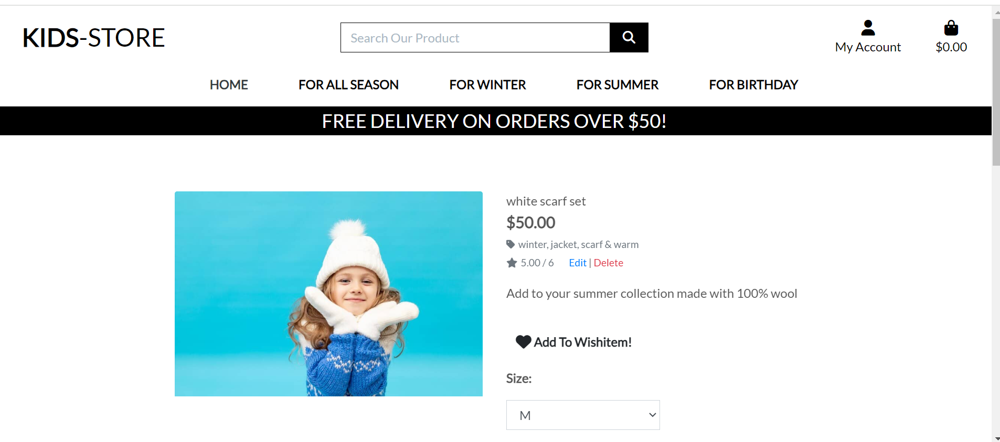

* When Accessed from the <b>/admin</b>

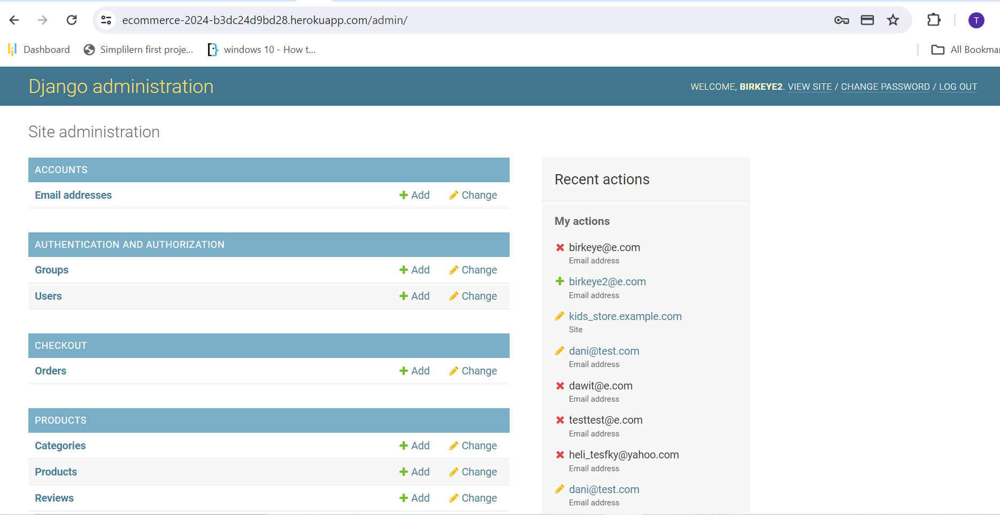

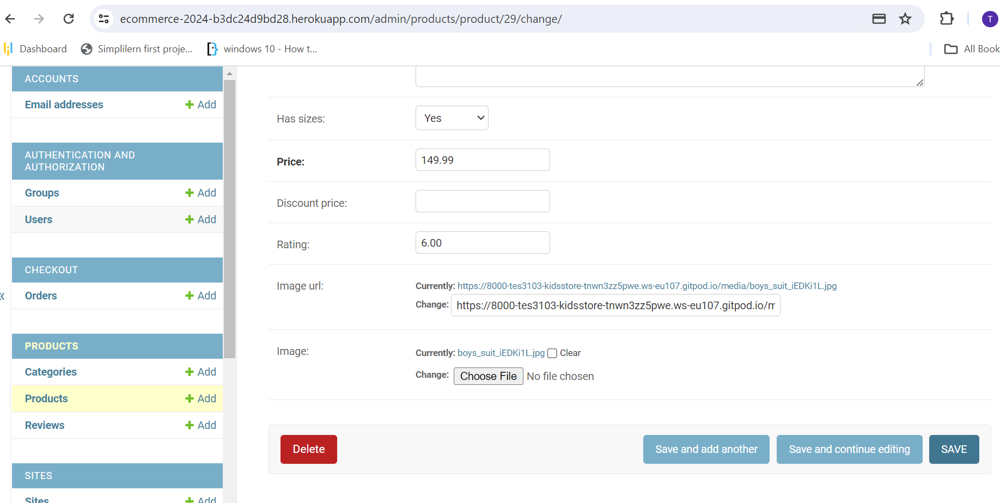

#### Log-Out

* LogOut: The Authonticated Customer can logout using the button in the my account section and then a logout conformation message will pop up to confirm the logout process.

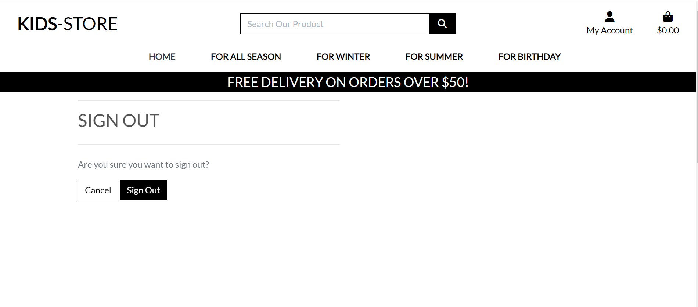

Back to[Top](#table-of-content)
---
### Shopping Bag

* Once the customer selects all his prefered collections it will be collected to the shopping bag with the calculated grand total price and the delivery cost status.The customer can go directely to the securecheckout section by tapping the button.Here the customer can also add, update and delete accoording to the wish.

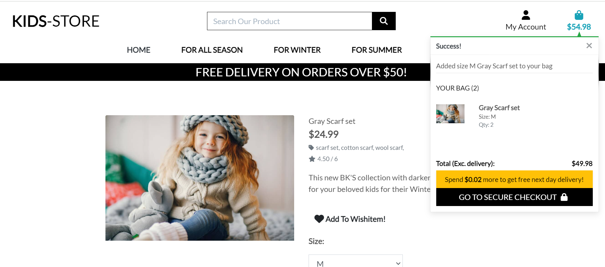

Back to[Top](#table-of-content)

### Product Page

* Product Filter: When the customer tab the different sections of the product a drop down menu will appear to choose from according to the wish

* Product Detail: When the product is selected it will desplay the detail descrption of the product with additional functionality

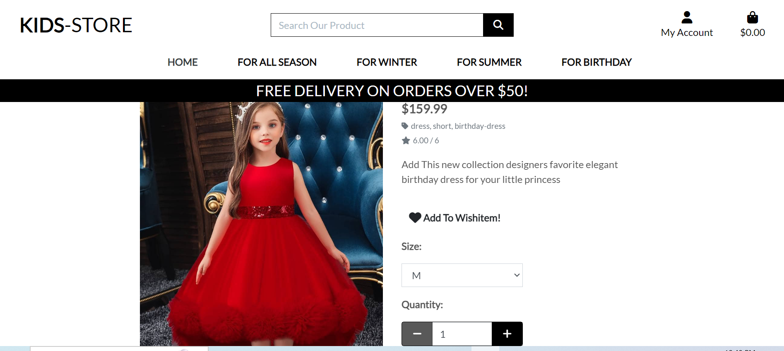

Back to [Top](#table-of-content)

### Profile Page

* Authenticated Customers: Onece the customer sign in with the right credentials the profile page is accessible and with the detaild information and past activities. The customer can add, edit, and delete according to their wish and can also save the default delivery section by cleaking the radio button.

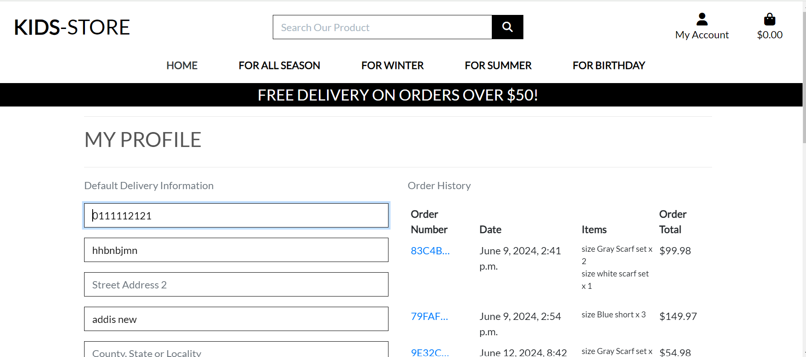

* The Authenticated Customer can not access the admin site if tried a messaege with not authorized to access a particular section of the website comes with a guide to the different section of the page

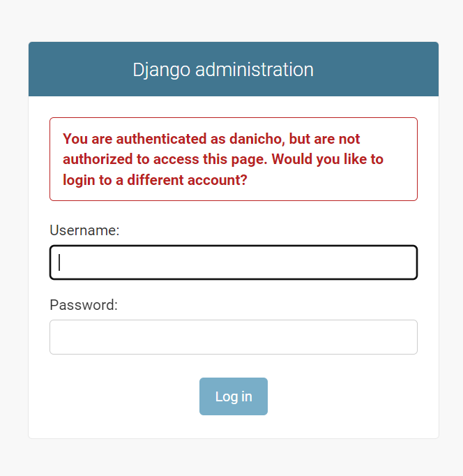

### **Future Features**

