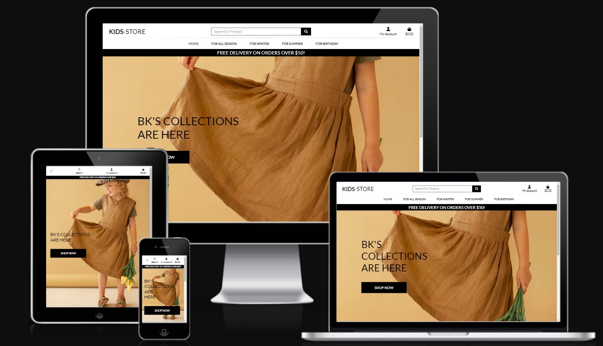
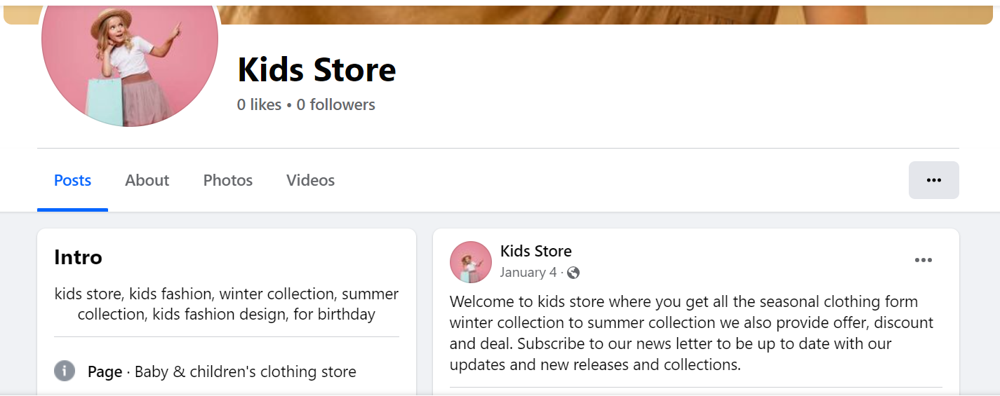

# kids Store
Kids-Store is a fictitious full function B2C e-commerce kids’ department, powered by Django. This is a final project for the Full-Stack Software Development Course at Code Institute.

#### To see the Live Link: [click here](https://ecommerce-2024-b3dc24d9bd28.herokuapp.com/)

## Table of Content:
* [Introduction](#introduction)
* [UI/UX](#ui/ux)
  * [User Demographic](#user-demographic)
  * [User Stories](#user-stories)
  * [Wireframes](#Wireframes)
  * [Flowchart](#Flowchart)
* [Technologies Used](#technologies-used)  
* [Features](#features) 
  * [Existing Features](#existing-features)
  * [Future Features](#future-features)
* [Marketing Strategy](#marketing-strategy)  
* [Testing](#testing)
* [Deployment](#deployment-heroku)
* [How to Fork this Repository](#how-to-fork-this-repository)
* [How to clone this Repository](#how-to-clone-this-repository)
* [Technologies Used](#Technologies-used)
* [Credits](#credits)
* [Acknowledgments](#acknowledgments)
---
Back to [Top](#kids-store)

## **Introduction**
Our Departemt Store focuses on Kids clothing specializing in Seasonal and Occational dressing. Our designers collections specially for Birthday for all gender are the one which makes Our Departemet Store Standout form Our Competiters.
We also supply for our Cutomers Limited Editions according to their test for their little Engels at any time of the year. 
## **UI/UX**
  ### **User Demographic**
  This Site Targets Users Who are:

  * Looking a unique designer Clothing For Their <b>Little</b> ones.
  * Looking for quality fabrick with affordable price
  * Looking for multi alternatives with diverse size and color
  * Looking for seasonal clothing before hand 

  ### **User Stories**

  * As a Site User I can access the available offer so that I can easily use the opportunity on selected products

* As a Site User I can view a list of products categories so that I can easily select for my purchase

* As a Site User I can select a particular product so that easily have a detailed description available size with picture and add to cart option

* As a Site User I can have an option to purchase without an account so that I can quickly pick what I want

* As a Site User I can register to the website so that I can have a personalized profile and easily interact for the purchasing process

* As a Site User I can have my account so that I can easily login/logout

* As a Site User I can have a personal user profile so that I can easily access my order story, order conformation and payment information

* As a Site User I can have an easy password recovery option so that I can easily recover my password if I forgot it

* As a Site User I can have an easy searching option so that I can easily search a specific item from the list

* As a Site User I can sort multiple categories of products with description so that I can easily compare the quality and price

* As a Site User I can select my choice so that I can easily pick the right size, color and quality of my product

* As a Site User I can have a place to collect my choices so that I can easily pick what I really want to purchase

* As a Site User I can easily fill my payment information so that I can easily check out and settle the payment 

* As a Site User I can view an order conformation after checkout so that I cans easily verify everything went well

* As a Site User I can receive an email conformation after checkout so that I can easily keep the conformation of what I have purchased for my records

* As a site User I can have the option to keep my wishes so that I can easily select 

* As a Site Admin I can view my store so that I can easily inspect the overall situation of my site

* As a Site Admin I can add a product so that I can easily add new items to my store so that I can stay competitive

* As a Site Admin I can edit the product so that I can easily update the product with price and quality

* As a Site Admin I can delete a product so that I can easily remove products that are not for sale

### **Wireframes**

  Wireframe are used to give a visual feedback after taking the general structure of the site and they also help as a reminder for the basic components of the site

  
  

### **Flowchart**
This flowchart was created to determine the flow of the website. It shows which pages are available to the user. It takes into account if the user is logged in to the website or not.

Back to [Top](#table-of-content)

## **Technologies Used**
* *Django* - The Django framework was used to develop this application.
* *Django AllAuth* - Used to create account, login and logout users of the site.
* *Python* - This application was developed using Python.
* *ElephantSQL* - was used to host the external database.
* *HTML* - was used to develop the templates in this project.
* *CSS* - was used to style the page by customizing it.
* *Lucid chart* - Used to create the flowchart.
* *Bootstrap* - was used for the fast development of the layout and styling
* *Gitpod* - IDE used for the development of the  application.
* *GitHub* - The code for this application is stored on GitHub.
* *Git* - Used for version control.
* *Heroku* - Used for development.
* *Stripe* - was used for checkout functionality and facilitate online payments
* *AWS* - for object storage through a web service interface

Back to [Top](#table-of-content)

## **Features**
### **Existing Features**

### Home Page

* A home page also displaying a quick link to the shopping area of the site.
* A home page with a search options, Account registration and login, shopping bag and clicable dropdown nav link displaying different features of the products

* A home page renders well for all screen size media.

### Search Bar

* Search button: This will help our Customers esily search for the particular product

### My Account

* My Account: This Section will give the Customer to Register and for the registerd customer can login using this. The Site Admin can also Login Using his/her credentials

* Account Registation Form: This form will display the detaild input with a requird fild. When it is filled with the correct information a conformation email will be sent to the customer and onece confirmed a successful registration success message will display.

#### Sign-Up

#### Sign-In

* Sign In: Once the customers successfully registed they can use their credentials to sign in and access their profile.They also get the success message using either their User name or email. If the customer forgets the password it can be easily reconfigured using the forgot password link

##### Admin/Super user 

* The Admin can access teh Administrative page from both Home page and /admin.When Accessd from the Home page

* When Accessed from the <b>/admin</b>

#### Log-Out

* LogOut: The Authonticated Customer can logout using the button in the my account section and then a logout conformation message will pop up to confirm the logout process.

Back to[Top](#table-of-content)

### Shopping Bag

* Once the customer selects all his prefered collections it will be collected to the shopping bag with the calculated grand total price and the delivery cost status.The customer can go directely to the securecheckout section by tapping the button.Here the customer can also add, update and delete accoording to the wish.

Back to[Top](#table-of-content)

### Product Page

* Product Filter: When the customer tab the different sections of the product a drop down menu will appear to choose from according to the wish

* Product Detail: When the product is selected it will desplay the detail descrption of the product with additional functionality

Back to [Top](#table-of-content)

### Profile Page

* Authenticated Customers: Onece the customer sign in with the right credentials the profile page is accessible and with the detaild information and past activities. The customer can add, edit, and delete according to their wish and can also save the default delivery section by cleaking the radio button.

* The Authenticated Customer can not access the admin site if tried a messaege with not authorized to access a particular section of the website comes with a guide to the different section of the page

* when the order is completed an Order conformation email will be sent

Back to [Tpo](#table-of-content)

## Checkout Page

* When the customer tab the Secure checkout button will be directed to the form with required filled. After sequring all the fileds the stripe payment procceds and at the end a success complete message will render with all the detail descriptions and this will be added to the customer profile section and a conformation email will be sent.

* If the customer miss the required filled or input wrong the waning message will pop up

* If the Customer input real credit card warining message will pop up since this is Educational Purpose project/ test 

### 404 Page

### **Future Features**

* Currentely the wishitem page not function fully in the future I would like to enhance the functionality of the page
* I would like to have designers to meet with our customers who needs special order for unique design and material
* Enable a live chat session with the site admin and customers

Back to [Top](#table-of-content)

## Kids-Store Business Model

### Web Marketing Strategies
* Though there are a lot of marketing techniques for businesses, Kids-Store decided use the Social media, facebook to drive out content and engage with customers. Visit our facebook page [here](#https://www.facebook.com/people/Kids-Store/61555399526567/)

#### Facebook Business Page

 

Back to [Top](#table-of-content)

## Email Marketing
* The free version of mailchimp was chosen with the current status of the business. Each user that signs up is added to the future marketing update.

## SEO
* The meta keywords and description in base.html have been amended to the researched keywords.
* I also added a sitemap.xml and robots.txt file to the website's root directory for search engines to crawl the site.
* A sitemap is a method of classifying a website, indicating the URLs and the information contained within each section.
* The URLs on your website that a search engine crawler is permitted to visit are specified in a robots.txt file.

## Testing

### Manual Testing

* Each section of the website has been tested.Testing different devices and screen resolutions has been conducted using Google DevTools.

### Navigation Bar
**Test**|**Action**|**Expected**|**Result**
-----|-----|-----|:-----:
Logo|Clicked logo|When the logo is clicked it will return the user to the home page|pass
Home nav link|Clicked Home on the nav bar|When clicked it will direct the user to the home page|pass
Search bar link|Clicked the search icon after the keyword entered|When clicked it will direct the user to the output-page|Pass
Search bar link|Clicked the search icon with out a  keyword entered|When clicked it will display an error message|Pass
My Account nav link|Clicked Register on the nav bar|When clicked it will direct the user to the sign up page|Pass
My Account nav link|Clicked Login on the nav bar|When clicked it will direct the user to the sign in page|Pass
Shopping Bag nav link|Clicked Shopping Bag on the nav bar|When clicked it will direct the Authorized user to the list of collected items with grand total if any|Pass
Nav menu responsive|Change the Device Size|When browser is resized the nav bar will remain responsive across all device sizes|Pass

### Register
**Test**|**Action**|**Expected**|**Result**
-----|-----|-----|:-----:
Register form|Filled out all required fields of register form and clicked sign up|When sign up button is clicked it will create an account for the user after email conformation and sign them into the site|Pass
Register - success message|Created an account on the register page and observed the success message|When user creates an account they are signed-in a success message is displayed|Pass
Register form validation|Clicked sign up and left the required field blank|If sign up is clicked without a required input field being filled a pop up will detail this to the user|Pass

### Sign In
**Test**|**Action**|**Expected**|**Result**
-----|-----|-----|:-----:
Sign in form|Fill out all required fields of sign in form and clicked sign in|Once the sign in form is filled out correctly and sign in button is clicked it will sign them into the site|Pass
Sign in - success message|Signed in and observed the success message|When user signs in they are redirected to café-board home page and a success message is displayed|Pass
Sign in page responsive|Resized browser and checked the sign in page at different screen resolutions|When the screen size is changed the sign in page will adapt to the different screen size|Pass

### Product
**Test**|**Action**|**Expected**|**Result**
-----|-----|-----|:-----:
All product Links|Clicked they display a differnt filter mechanisms |Once selected will display accordingely|Pass
All product Links|Clicked to a particular product |display the detail description accordingly|Pass
Select Size and Quantity Link|Click the dropdown menu or add button|Select the Size and increase or decrease the quantity|Pass
Add to bag or wishlist|clicked to a particular choice|Add the selected product to the bag or wishitem|pass

### Profile
**Test**|**Action**|**Expected**|**Result**
-----|-----|-----|:-----:
Edit profile information|Edited username and clicked update user|The user can edit their username or email by filling out the form on the edit user page and clicking update user|Pass
Delete profile|Clicked delete account and clicked delete account again on the modal, tried to sign in using the deleted account details|When the delete account button is clicked a modal will pop up to the user to confirm this action, once delete account is clicked the user will be redirected to the logged out home page with a warning message|Pass
Delete history|Clicked delete on a history|Once the user clicks delete next to a purchase history the history will be removed and a warning message is displayed to the user|Pass

### Logout
**Test**|**Action**|**Expected**|**Result**
-----|-----|-----|:-----:
Logout|Clicked the Logout button|Users can logout of the site by clicking the sign out button, they will be redirected to the logged out home page|Pass
Logout - warning message|Logged out of the site and observed the message|Once logged out a message will detail this to the user|Pass

### Footer
**Test**|**Action**|**Expected**|**Result**
-----|-----|-----|:-----:
Facebook link clickable|Clicked the Facebook icon|When clicked the Facebook icon will open a new window to Facebook|Pass
Twitter link clickable|Clicked the Twitter icon|When clicked the Twitter icon will open a new window to Twitter|Pass
Instagram link clickable|Clicked the Instagram icon|When clicked the Instagram icon will open a new window to Instagram|Pass
Policy link clickable|Clicked the Policy  icon|When clicked the Policy link will open a new window to In|Pass
Footer responsive|Resized the browser and checked the footer at different resolutions|Footer will fit the samll screen size|Pass

